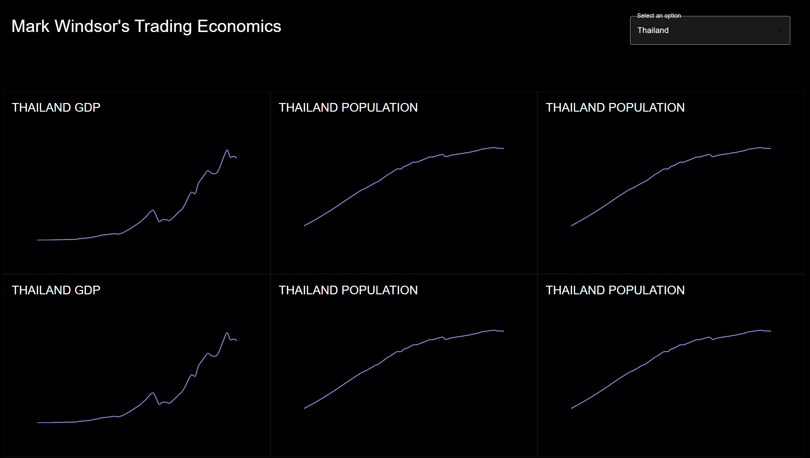

## Getting Started

First, run the development server:

```bash
npm i
npm run dev
```

Open [http://localhost:3000](http://localhost:3000) with your browser to see the result.

Only gdp and population parameters was working for me on the free tier. No where on the docs had a list of available time series indicators besides gdp and population. The goal was to select all countries and have a large grid of time series for different indicators.

